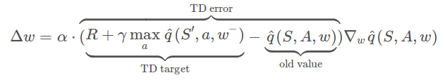
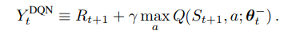
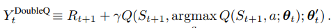
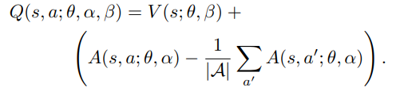
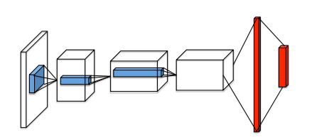
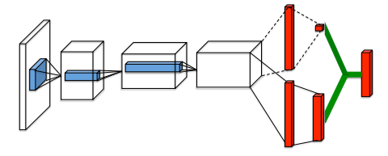
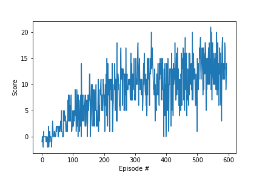
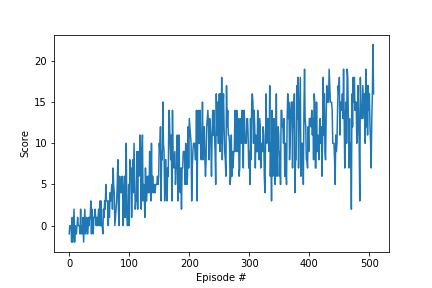
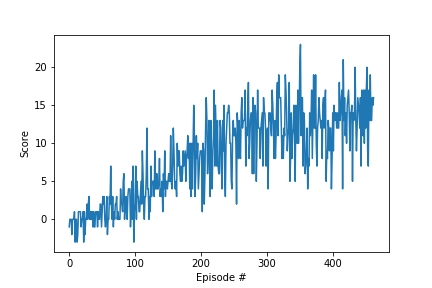

# Project Report - Navigation

## Learning Algorithm

The agent has been trained using 3 different learning algorithms
1. DQN
2. DDQN
3. Duelling DQN

### The network weights updation rule is as follows :

### The TD Target for the 3 specifies algorithms are:
1. DQN
  

2. DDQN
  

3. Duelling DQN
  

### The network architectures for DQN and DDQN is :

with the only change that in DDQN there are 2 copies of the same network.

### The network architectures for Duelling DQN is:

The common hyperparameters for the 3 algorithms are:
    
    BUFFER_SIZE = int(1e4)  # replay buffer size
    BATCH_SIZE = 64         # minibatch size
    GAMMA = 0.99            # discount factor
    TAU = 1e-3              # for soft update of target parameters
    LR = 5e-4               # learning rate 
    UPDATE_EVERY = 4        # how often to update the network    

The model used for DQN and DDQN algorithms is a 4 layered NN with 2 hidden layers 
each having 256 units with relu activations, whereas on the last layer no activations have been applied.
    

For Duelling DQN, a bifurcation at the last layer has been made to compute V(s) and A(s,a) respectively.

They have been merged using V(s) + A(s,a) - mean(A(s,a))

The NN parameters have also been changed to 128 units in each hidden layer.

## Results

The number of episodes taken by DQN, DDQN and Duelling DQN respectively are:

1. 496
2. 407
3. 362

The plots of reward vs episodes for DQN, DDQN and Duelling DQN respectively are:
1. 
2. 
3. 

A video named "banan.mp4" of the agent playing the game has also been provided in the repo.

## Future Work:

### Trying out new environments:

Application of these algorithms directly on pixel version of this project. For this, a CNN network should be applied on the input state and then further CNN layers and then a fc layer in the Q-Network architecture. Furthermore, applying these techniques to replicate the results in the Atari Task would be cool too. I have even applied these techniques on the Atari-Pong environment and have got awesome results. 

### Hyperparameter tuning:

Tweaking of no of nodes in each layer and changing maximum episode length can be done to see the networks performance. Initially I had taken 128 units in the hidden layer, but that took around 1300 episodes to train. So, one can play around with these based on available resources and time constraints.
